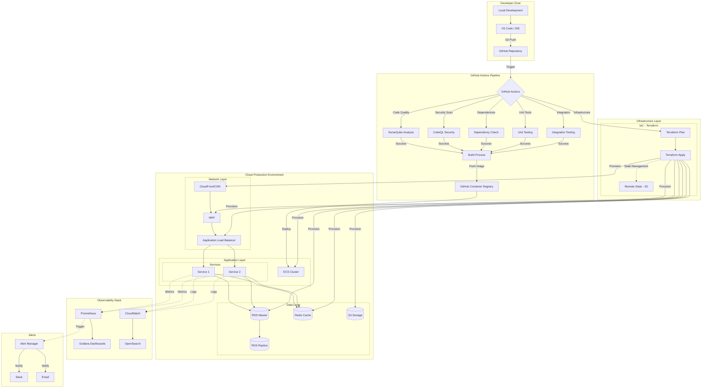

```mermaid
flowchart TB
    %% Development Zone
    subgraph "Developer Zone"
        direction TB
        dev_local[Local Development]
        ide[VS Code / IDE]
        dev_local --> ide
        ide -->|Git Push| github[GitHub Repository]
    end

    %% GitHub Actions Pipeline
    subgraph "GitHub Actions Pipeline"
        direction TB
        github -->|Trigger| actions{GitHub Actions}
        actions -->|Code Quality| sonar[SonarQube Analysis]
        actions -->|Security Scan| codeql[CodeQL Security]
        actions -->|Dependencies| deps[Dependency Check]
        actions -->|Unit Tests| unit[Unit Testing]
        actions -->|Integration| integration[Integration Testing]
        
        %% Build Process
        sonar & codeql & deps & unit & integration -->|Success| build[Build Process]
        build -->|Push Image| ghcr[GitHub Container Registry]
    end

    %% Infrastructure Management
    subgraph "Infrastructure Layer"
        direction TB
        subgraph "IaC - Terraform"
            tf_state[Remote State - S3]
            tf_plan[Terraform Plan]
            tf_apply[Terraform Apply]
        end
        
        actions -->|Infrastructure| tf_plan
        tf_plan --> tf_apply
        tf_apply -.->|State Management| tf_state
    end

    %% Cloud Infrastructure
    subgraph "Cloud Production Environment"
        direction TB
        subgraph "Network Layer"
            cdn[CloudFront/CDN]
            waf[WAF]
            alb[Application Load Balancer]
        end

        subgraph "Application Layer"
            ecs_cluster[ECS Cluster]
            subgraph "Services"
                service1[Service 1]
                service2[Service 2]
            end
        end

        subgraph "Data Layer"
            direction TB
            rds_master[(RDS Master)]
            rds_replica[(RDS Replica)]
            redis[(Redis Cache)]
            s3[(S3 Storage)]
        end

        cdn --> waf
        waf --> alb
        alb --> service1 & service2
        service1 & service2 --> rds_master & redis
        rds_master --> rds_replica
    end

    %% Monitoring & Logging
    subgraph "Observability Stack"
        direction TB
        cloudwatch[CloudWatch]
        prometheus[Prometheus]
        grafana[Grafana Dashboards]
        opensearch[OpenSearch]
        
        service1 & service2 -.->|Metrics| prometheus
        service1 & service2 -.->|Logs| cloudwatch
        prometheus --> grafana
        cloudwatch --> opensearch
    end

    %% Deployment Flow
    ghcr -->|Deploy| ecs_cluster
    tf_apply -->|Provision| cdn & waf & alb & ecs_cluster & rds_master & redis & s3

    %% Alerts & Notifications
    subgraph "Alerts"
        direction TB
        alerts[Alert Manager]
        slack[Slack]
        email[Email]
    end
    
    prometheus -.->|Trigger| alerts
    alerts -->|Notify| slack & email

```